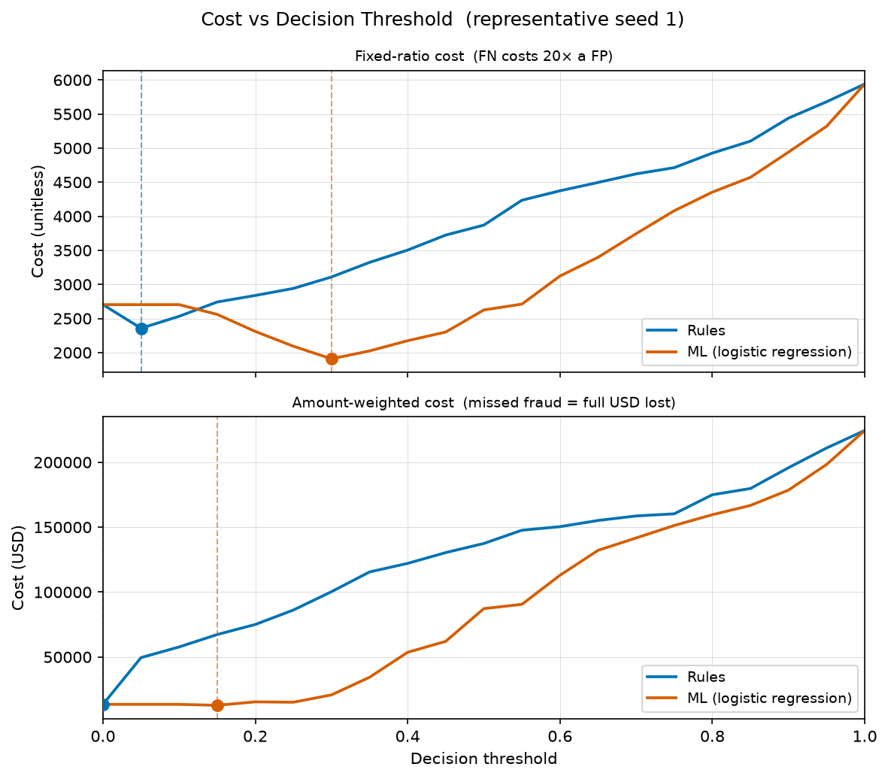
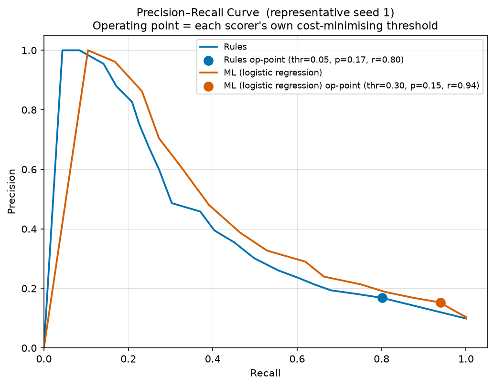
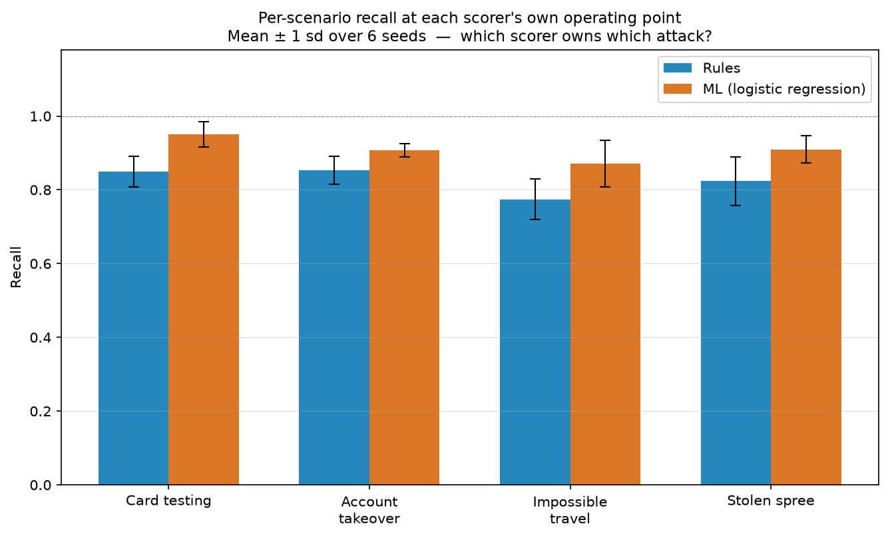
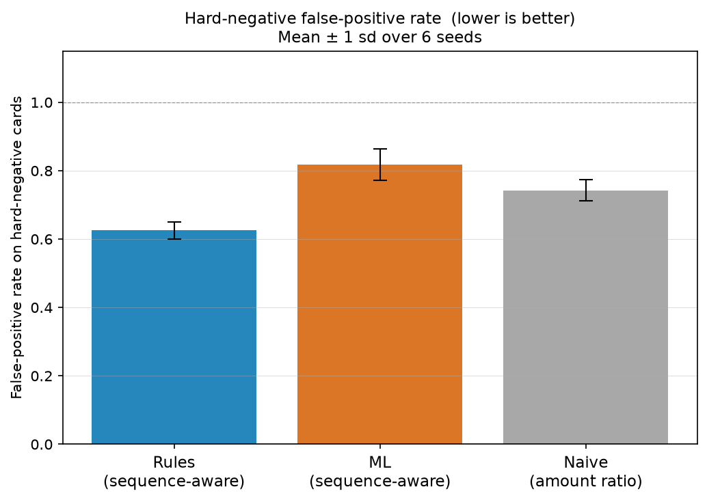
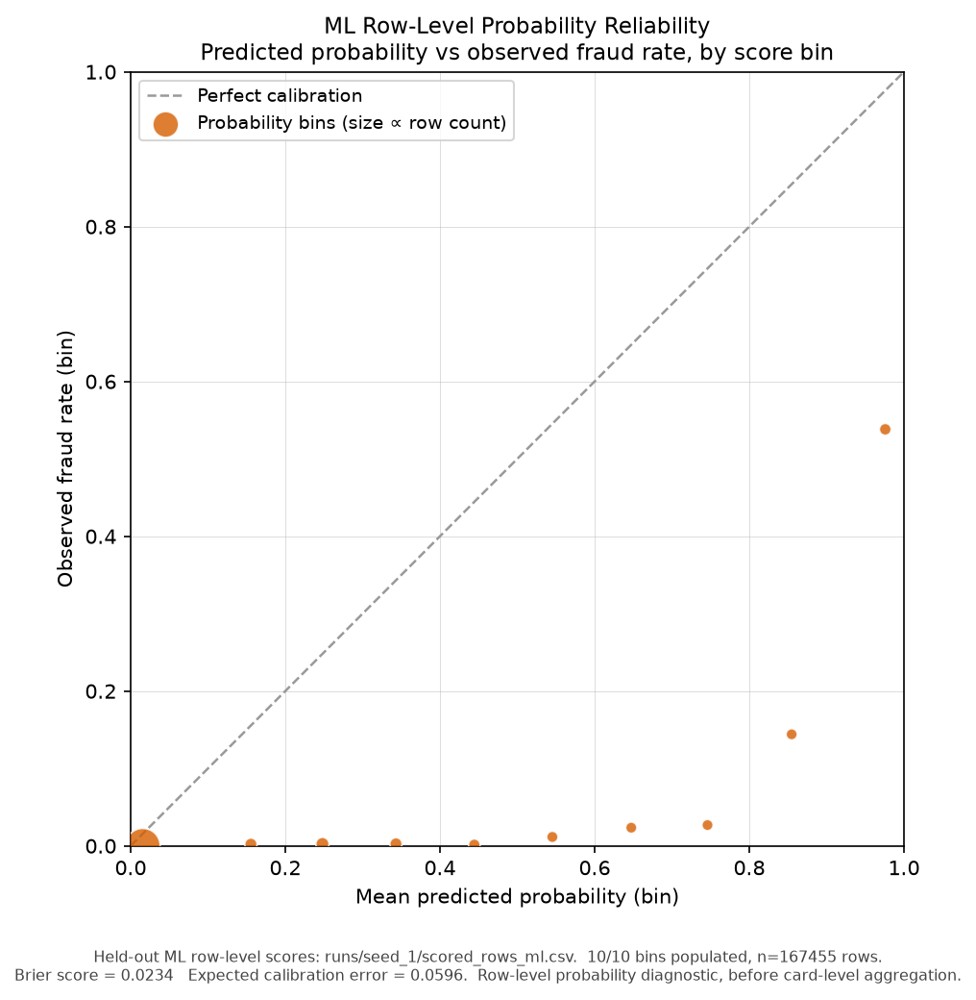

# Sequence-Aware Fraud Detection Evaluation Harness

Card fraud is not a property of a single transaction. A $4 online purchase is
unremarkable alone; six of them in ninety seconds from an unrecognised device is
a card-testing attack. The signal lives in the *sequence*, not in any row read
alone.

This project is the apparatus to make that measurable: it generates synthetic
transaction data with known fraud sequences and deliberately ambiguous
legitimate behaviour ("hard negatives"), scores it, and evaluates the scorer
under an explicit **cost model** rather than accuracy — which is meaningless at a
sub-1% fraud rate, where flagging nothing scores ~99.7%.

The deliverable is not a fraud model. It is the harness that tells you whether
*any* fraud model is good enough, where it fails, and at what threshold to run it.

## Why this is relevant to AI systems

This project is about evaluation design, not fraud domain expertise. The same pattern applies to LLM-assisted workflows:

- generate or collect labelled cases
- include hard negatives / near misses
- separate model implementation from evaluation
- score outputs against business-relevant cost models
- choose operating thresholds explicitly
- report failure modes by scenario, not only blended metrics

---

## Architecture

The pipeline is a package of modules connected by CSV interfaces, each
independently runnable and testable.

```
generate_synthetic.py  -->  transactions.csv  --+
                            (native currency)    |
                       fx_rates.csv  ------------+--> profile.py   --> card_profiles.csv --+
                                                 |                                          |
                                                 +--> features.py <-------------------------+
                                                          |
                                                          v
                                            score.py / score_ml.py --> evaluate.py
```

| Module | Responsibility |
|---|---|
| `fx.py` | Currency→USD conversion; `fx_rates.csv` writer |
| `generate_synthetic.py` | Labelled synthetic transactions with injected fraud sequences and hard negatives |
| `profile.py` | Per-card USD-normalised baseline |
| `features.py` | Sequence deltas, trailing point-in-time baseline, profile join |
| `scorer.py` | `Scorer` protocol — the interface seam for the ML swap-in |
| `score.py` | `RuleScorer`: five transparent rules + card-level aggregation |
| `score_ml.py` | `MLScorer`: logistic regression behind the same protocol, trained out-of-sample |
| `evaluate.py` | Threshold sweep, cost models, per-scenario recall, operating-point diagnostics, hard-negative analysis |

**Swap contract:** only the scorer changes when the ML model replaces the rule
baseline. `RuleScorer` and `MLScorer` both satisfy the `Scorer` protocol;
`features.py` and `evaluate.py` are untouched. This is what makes the
rules-vs-ML comparison a fair test.

---

## Fraud scenarios and hard negatives

Each fraud scenario has a hard-negative twin: legitimate behaviour separated from
fraud by exactly one dimension. The twins are why a single-row threshold fails on
precision.

| Fraud scenario | Fingerprint | Hard-negative twin | Separating dimension |
|---|---|---|---|
| `card_testing` | Many tiny online amounts, minutes apart, new device | — | velocity + amount cluster |
| `account_takeover` | New device + new IP country, escalating amounts | `hard_neg_new_device`: new device, **home** country, normal amounts | country + amount |
| `impossible_travel` | Legit local txn, far-country txn minutes later | `hard_neg_travel`: far country, but **hours** apart | time delta |
| `stolen_spree` | Run of mid/large purchases, unusual categories | `hard_neg_big_ticket`: **one** large legit purchase | run length |

---

## Setup

```bash
python3 -m venv .venv
source .venv/bin/activate
python3 -m pip install -r requirements.txt   # pytest only; pipeline is stdlib
```

## Running the pipeline

```bash
python -m fraud_eval.fx --out fx_rates.csv
python -m fraud_eval.generate_synthetic --cards 1000 --days 30 --out transactions.csv
python -m fraud_eval.profile --in transactions.csv --fx-rates fx_rates.csv --out card_profiles.csv
python -m fraud_eval.features --txns transactions.csv --profiles card_profiles.csv --fx-rates fx_rates.csv --out featured.csv
python -m fraud_eval.score --in featured.csv --agg decaying_sum --row-out scored_rows.csv --card-out scored_cards.csv
python -m fraud_eval.evaluate --rows scored_rows.csv --cards scored_cards.csv
```

Randomness is seeded; the same `--seed` produces byte-identical output.

## Running the tests

```bash
python -m pytest tests/ -q
```

64 tests covering the brief's acceptance criteria and regression checks run
entirely in memory. The figure tests skip cleanly if the optional `viz`
plotting stack is not installed, so the core test job needs only
`requirements.txt`.

---

## Rules vs ML: the central finding

The rule baseline and an ML scorer (`score_ml.py`, logistic regression trained
on a different seed from the evaluation data) are compared on the **same**
harness. The result is not "one wins": at each scorer's own cost-minimising
operating point, the two sit at **different points on the precision/recall
frontier**. Which you prefer depends on the cost model — which is exactly the
trade-off the harness is built to surface.

Comparing the two at a single shared threshold (e.g. 0.50) is misleading: a
calibrated ML probability and a hand-tuned rule score do not mean the same thing
at the same number. `evaluate.py` reports diagnostics at each scorer's own
operating point, not a shared one.

Per-scenario recall is reported separately for each attack type — a blended
number hides that a detector may catch sprees and miss card-testing entirely.
Figures below are **mean ± sample standard deviation over 6 independent seeds**
(3,000 cards each, 10% fraud rate, seed pairs (1,101)…(6,106) via
`scripts/run_seed.py` and `fraud_eval/aggregate_runs.py`):

| Scenario | Rules (@ thr 0.05) | ML (@ thr ~0.30) |
|---|---|---|
| Card testing | 0.850 ± 0.042 | 0.950 ± 0.036 |
| Account takeover | 0.860 ± 0.036 | 0.909 ± 0.019 |
| Impossible travel | 0.774 ± 0.055 | 0.837 ± 0.065 |
| Stolen spree | 0.824 ± 0.066 | 0.907 ± 0.033 |

ML achieves higher recall on all four scenarios. The raw thresholds are not
directly comparable because the scorers use different score scales; at their own
operating points, ML trades more hard-negative false positives for more fraud
recall.

**Hard-negative false-positive rate** — the clearest measure of whether
sequence context earns its keep. Hard-negative cards are by construction the
legitimate accounts most likely to be confused with fraud:

| Approach | FP rate on hard-negative cards |
|---|---|
| Rules (sequence-aware) | **0.625 ± 0.026** |
| Naive single-row amount threshold | 0.743 ± 0.030 |
| ML (sequence-aware) | 0.807 ± 0.056 |

The rules scorer sits 12 points below the naive baseline — it earns its
complexity. The ML scorer sits 6 points above it: at its own operating point,
the model flags more hard-negative cards than a simple amount threshold would.
This is not a failure of the sequence features; it is a consequence of the ML
model's higher recall. The explicit fingerprints in the rules — merchant/IP
country-change within three hours, velocity burst above a count threshold — are
designed to fire on fraud sequences and not on their near-twins. A linear
classifier that cannot express those exact conditions trades hard-negative
precision for recall.

The two cost models (fixed 20:1 vs. amount-weighted) prefer different operating
thresholds — surfaced as a business decision, not resolved by the harness.

### Figures



*Cost vs decision threshold (representative seed 1). Stacked panels because the
two y-scales differ by orders of magnitude. Dashed lines mark each scorer's
cost-minimising threshold.*



*Precision–recall curve (representative seed 1). Each scorer's operating point
is marked at its own cost-minimising threshold, not a shared one.*



*Per-scenario recall at each scorer's own operating point. Mean ± 1 sd over 6
seeds. ML leads on recall across all scenarios; the overlap on impossible travel
is widest because that scenario's recall is most variable across seeds.*



*Hard-negative false-positive rate. Lower is better. Rules beats the naive
single-row baseline; ML does not at its operating point.*



*ML row-level probability reliability (held-out seed 1). Each point is a score
bin: mean predicted probability against the observed fraud rate, versus the
diagonal perfect-calibration line.*

### ML probability reliability

The ML scorer emits a per-row probability via logistic regression. Before those
row scores are aggregated into a card-level operating score, the harness checks
whether they can be read as probabilities at all: when the model assigns a row a
score near *p*, is the observed fraud rate in that band also near *p*?

`viz/reliability.py` bins the held-out row scores over `[0, 1]` and reports the
**Brier score** (mean squared error between score and label) and the
count-weighted **expected calibration error**. On the representative seed the
row scores are **overconfident**: Brier ≈ 0.023, ECE ≈ 0.060, with the mid- and
upper-range bins sitting well below the diagonal — `class_weight="balanced"`
inflates the raw probabilities to handle the severe imbalance. That is a useful
caveat, not a contradiction of the detection results: the card-level
decaying-sum score is an *operating* score chosen by threshold, and is **not**
described anywhere as a calibrated probability. This diagnostic is a probability
check on the row score, not a threshold selector.

```bash
python -m viz.reliability \
    --rows runs/seed_1/scored_rows_ml.csv \
    --out runs/seed_1/reliability_ml.json --bins 10 --report
```

---

## Key design decisions

- **All-rows baseline.** The card profile is built from all transactions, not
  labelled-legitimate ones only, because in production labels don't exist at
  profile-build time. Fraud rows nudge the statistics upward; the trailing
  point-in-time baseline in `features.py` recovers the signal using only prior
  rows, with no look-ahead.
- **Cost-weighted evaluation.** Two configurable cost models; accuracy is never a
  headline metric.
- **Decaying-sum aggregation.** Card scores accumulate with exponential decay
  (default `0.9`) so many small signals (card-testing) can outweigh one isolated
  medium signal, which `max` would underweight.
- **Explainable baseline first.** Every rule decision carries a reason string,
  and the ML swap-in is measured against this baseline on the same harness.

---

## Running the multi-seed evaluation

The per-scenario figures above come from a 6-seed run. Each seed pair generates
independent eval and train datasets, scores with both scorers, and writes
per-seed artifacts to `runs/seed_N/`:

```bash
for i in 1 2 3 4 5 6; do
    python scripts/run_seed.py --eval-seed $i --train-seed $((i + 100))
done
python -m fraud_eval.aggregate_runs   # reads runs/seed_*/metrics_*.json
pip install -r viz/requirements-viz.txt
python -m viz.reliability \
    --rows runs/seed_1/scored_rows_ml.csv \
    --out runs/seed_1/reliability_ml.json   # row-level ML calibration
python -m viz.make_plots                     # writes viz/figures/*.png (all 5)
```

`scripts/run_seed.py` uses library calls throughout (no subprocess shelling)
and keeps the cost knobs fixed across all seeds so operating points are
comparable. Alongside the per-seed sweep and metrics, it now persists the
held-out scored rows and cards (`scored_rows_{rules,ml}.csv`,
`scored_cards_{rules,ml}.csv`) — the inputs for the reliability diagram and the
investigation layer below. `fraud_eval/aggregate_runs.py` uses sample standard
deviation (`statistics.stdev`, n−1) and skips absent scenarios rather than
zero-filling.

## Running the ML scorer

The ML scorer trains out-of-sample — on data generated with a different seed
from the evaluation set — so it is never evaluated on rows it learned from:

```bash
# generate + feature a training set on one seed, an eval set on another
python -m fraud_eval.generate_synthetic --seed 101 --cards 3000 --out transactions_train.csv
python -m fraud_eval.generate_synthetic --seed 1   --cards 3000 --out transactions_eval.csv
# (profile + features each, producing featured_train.csv and featured_eval.csv)

python -m fraud_eval.score_ml \
    --train-featured featured_train.csv --featured featured_eval.csv \
    --row-out scored_rows_ml.csv --card-out scored_cards_ml.csv

python -m fraud_eval.evaluate --rows scored_rows_ml.csv --cards scored_cards_ml.csv
```

The ML scored output drops into `evaluate.py` unchanged — the same harness, the
same cost models — which is what makes the rules-vs-ML comparison fair.

---

## Optional: investigation layer

A downstream `investigation/` layer turns high-scoring cards into structured
case notes for a human reviewer. It is a **pure consumer** of the scored
artifacts — it does not detect fraud, change scores, set thresholds, alter
features, or touch any core evaluation output, and it imports nothing from
`fraud_eval/`.

The local LLM here is a **constrained summariser, not the decision-maker and not
the threshold selector**. It is given only a prompt-safe payload (the card
score, the top suspicious rows, and a list of exact `evidence_facts`) — never
the ground-truth labels — and is asked to summarise evidence, flag missing
information, and recommend a review step from a fixed action set. Every note is
validated before it is written: required fields, an action within the allowed
enum, list shapes, a matching `card_id`, and no "confirmed fraud" conclusion or
customer-accusatory language. An invalid or unsafe note raises and is not
written.

```bash
python -m investigation.build_cases \
    --rows runs/seed_1/scored_rows_ml.csv \
    --cards runs/seed_1/scored_cards_ml.csv \
    --scorer ml --threshold 0.30 --limit 20 \
    --out runs/seed_1/investigation_cases.jsonl

# deterministic fake model — no network, used by tests and for a quick smoke run
python -m investigation.investigate \
    --cases runs/seed_1/investigation_cases.jsonl \
    --out runs/seed_1/investigation_notes.jsonl --fake
# or a real local model:
#   --llm-command "ollama run qwen2.5:1.5b"

python -m investigation.evaluate_notes \
    --cases runs/seed_1/investigation_cases.jsonl \
    --notes runs/seed_1/investigation_notes.jsonl \
    --out runs/seed_1/investigation_eval.json --report
```

`evaluate_notes.py` grades each note against a safety/usefulness rubric —
grounded evidence, no forbidden conclusion, valid action, a missing-information
request, customer-safe language, and hard-negative caution — and reports
per-case results plus aggregate pass rates. It grades whether the *note* is safe
and useful, not whether the fraud score was right; the core harness already
measures detection. The aggregate JSON is the committed artifact; raw model
outputs are kept out unless they are deterministic and small.

**Driving a weak local model.** `CommandModel` is model-agnostic — any command
that reads a prompt on stdin and prints a JSON note on stdout works. Small
models rarely emit clean JSON, so the adapter strips terminal/ANSI control codes
(e.g. from `ollama run`), extracts the first balanced `{...}` object out of any
surrounding prose or ```json fences, and parses leniently for literal newlines
in strings. Validation is **not** relaxed: malformed or off-contract notes are
still rejected. By default one bad generation aborts the batch (no partial
write); pass `--skip-invalid` to instead drop the failures (logging each) and
keep the valid notes — useful with a flaky small model. The evaluator then
reports any ungraded cases under `n_missing` rather than treating them as
failures. In practice a 1.5B model passes the safety checks but often scores low
on `grounded_evidence`, because it paraphrases the evidence instead of citing
`evidence_facts` verbatim — which is exactly the kind of weakness the rubric
exists to surface.
